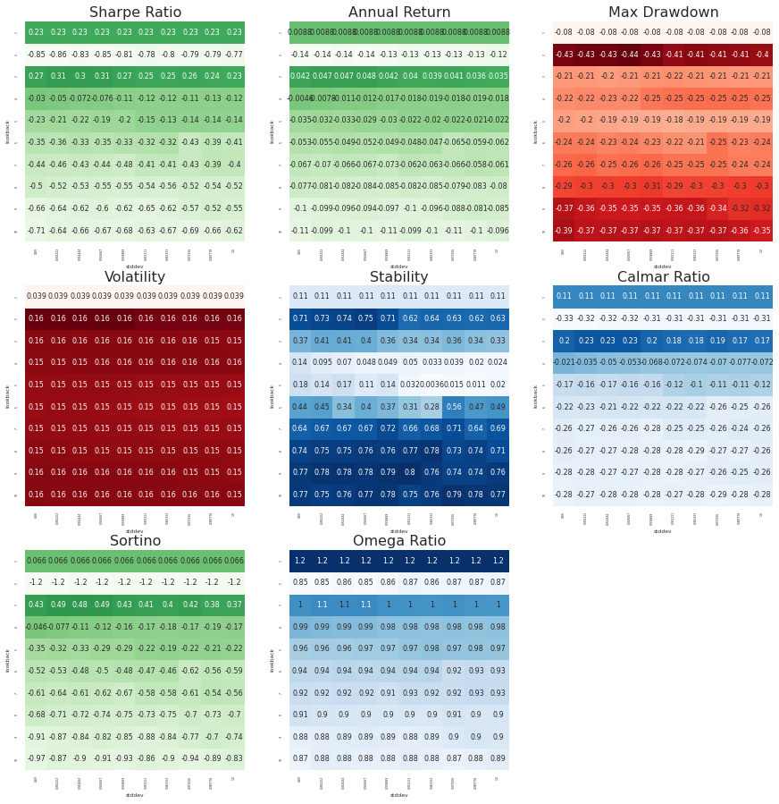

#Parameter Optimisation
##### Marcus Williamson - 01/09/15

1. Setup Environment
1. Import Algorithm
1. Setup Optimisation Tests
1. Review Performance

##All Weather V1 - Reversion Optimisation

###1. Setup Environment
####Import Libraries

    import zipline
    import pytz
    from datetime import datetime
    import matplotlib.pyplot as pyplot
    from collections import defaultdict
    
    from zipline import TradingAlgorithm
    from zipline.api import order_target, record, symbol, history, add_history, order_target_percent
    from zipline.api import schedule_function, date_rules, time_rules, order, get_open_orders, get_datetime
    from zipline.api import set_slippage, set_commission
    from zipline.api import slippage
    from zipline.api import commission
    
    from zipline.utils import tradingcalendar
    
    import numpy as np
    import pandas as pd
    import statsmodels.api as sm
    
    import seaborn as sns
    import matplotlib.pyplot as plt
    
    import time

####Define functions for evaluating performance

    # define a bunch of performance statistics for analysis of our backtests
    def normalize(returns, starting_value=1):
        return starting_value * (returns / returns.iloc[0])
    
    
    def cum_returns(returns, starting_value=None):
    
        # df_price.pct_change() adds a nan in first position, we can use
        # that to have cum_returns start at the origin so that
        # df_cum.iloc[0] == starting_value
        # Note that we can't add that ourselves as we don't know which dt
        # to use.
        if pd.isnull(returns.iloc[0]):
            returns.iloc[0] = 0.
    
        df_cum = np.exp(np.log(1 + returns).cumsum())
    
        if starting_value is None:
            return df_cum - 1
        else:
            return df_cum * starting_value
    
    
    def aggregate_returns(df_daily_rets, convert_to):
    
        def cumulate_returns(x):
            return cum_returns(x)[-1]
    
        if convert_to == 'weekly':
            return df_daily_rets.groupby(
                [lambda x: x.year,
                 lambda x: x.month,
                 lambda x: x.isocalendar()[1]]).apply(cumulate_returns)
        elif convert_to == 'monthly':
            return df_daily_rets.groupby(
                [lambda x: x.year, lambda x: x.month]).apply(cumulate_returns)
        elif convert_to == 'yearly':
            return df_daily_rets.groupby(
                [lambda x: x.year]).apply(cumulate_returns)
        else:
            ValueError('convert_to must be weekly, monthly or yearly')
    
    
    def max_drawdown(returns):
    
        if returns.size < 1:
            return np.nan
    
        df_cum_rets = cum_returns(returns, starting_value=100)
    
        MDD = 0
        DD = 0
        peak = -99999
        for value in df_cum_rets:
            if (value > peak):
                peak = value
            else:
                DD = (peak - value) / peak
            if (DD > MDD):
                MDD = DD
        return -1 * MDD
    
    
    def annual_return(returns, style='compound'):
    
        if returns.size < 1:
            return np.nan
    
        if style == 'calendar':
            num_years = len(returns) / 252.0
            df_cum_rets = cum_returns(returns, starting_value=100)
            start_value = df_cum_rets[0]
            end_value = df_cum_rets[-1]
            return ((end_value - start_value) / start_value) / num_years
        if style == 'compound':
            return pow((1 + returns.mean()), 252) - 1
        else:
            return returns.mean() * 252
    
    
    def annual_volatility(returns):
    
        if returns.size < 2:
            return np.nan
    
        return returns.std() * np.sqrt(252)
    
    
    def calmar_ratio(returns, returns_style='calendar'):
    
        temp_max_dd = max_drawdown(returns=returns)
        if temp_max_dd < 0:
            temp = annual_return(
                returns=returns,
                style=returns_style) / abs(max_drawdown(returns=returns))
        else:
            return np.nan
    
        if np.isinf(temp):
            return np.nan
    
        return temp
    
    
    def omega_ratio(returns, annual_return_threshhold=0.0):
    
        daily_return_thresh = pow(1 + annual_return_threshhold, 1 / 252) - 1
    
        returns_less_thresh = returns - daily_return_thresh
    
        numer = sum(returns_less_thresh[returns_less_thresh > 0.0])
        denom = -1.0 * sum(returns_less_thresh[returns_less_thresh < 0.0])
    
        if denom > 0.0:
            return numer / denom
        else:
            return np.nan
    
    
    def sortino_ratio(returns, returns_style='compound'):
    
        numer = annual_return(returns, style=returns_style)
        denom = annual_volatility(returns[returns < 0.0])
    
        if denom > 0.0:
            return numer / denom
        else:
            return np.nan
    
    
    def sharpe_ratio(returns, returns_style='compound'):
    
        numer = annual_return(returns, style=returns_style)
        denom = annual_volatility(returns)
    
        if denom > 0.0:
            return numer / denom
        else:
            return np.nan
    
    
    def stability_of_timeseries(returns, logValue=True):
    
        if returns.size < 2:
            return np.nan
    
        df_cum_rets = cum_returns(returns, starting_value=100)
        temp_values = np.log10(
            df_cum_rets.values) if logValue else df_cum_rets.values
        len_returns = df_cum_rets.size
    
        X = list(range(0, len_returns))
        X = sm.add_constant(X)
    
        model = sm.OLS(temp_values, X).fit()
    
        return model.rsquared
    
    def perf_stats(returns, returns_style='compound', return_as_dict=False):
    
        all_stats = {}
        all_stats['annual_return'] = annual_return(
            returns,
            style=returns_style)
        all_stats['annual_volatility'] = annual_volatility(returns)
        all_stats['sharpe_ratio'] = sharpe_ratio(
            returns,
            returns_style=returns_style)
        all_stats['calmar_ratio'] = calmar_ratio(
            returns,
            returns_style=returns_style)
        all_stats['stability'] = stability_of_timeseries(returns)
        all_stats['max_drawdown'] = max_drawdown(returns)
        all_stats['omega_ratio'] = omega_ratio(returns)
        all_stats['sortino_ratio'] = sortino_ratio(returns)
    
        if return_as_dict:
            return all_stats
        else:
            all_stats_df = pd.DataFrame(
                index=list(all_stats.keys()),
                data=list(all_stats.values()))
            all_stats_df.columns = ['perf_stats']
            return all_stats_df
        

###2. Import Algorithm
####Load data for backtests

    data = get_pricing(['SPY'],start_date='2010-01-01',end_date = '2013-01-01',frequency='minute')

####Define Algorithm

    lookback = 20
    sdev = 2.5
    
    def initialize(context): 
        
        context.input1 = symbol('SPY')
        context.lookback1 = lookback
        context.stdevparam = sdev
        context.average = 0
        context.stdev = 0
           
        
    def handle_data(context,data):
        
        if get_datetime().hour == 14 and get_datetime().minute == 30: #do this once per day
            
                context.average = history(context.lookback1,'1d', 'price')[context.input1].mean()
                context.stdev = history(context.lookback1,'1d', 'price')[context.input1].std()
            
    
        if (data[context.input1].price > context.average and context.portfolio.positions[context.input1].amount<0) or(data[context.input1].price < context.average and context.portfolio.positions[context.input1].amount>0):
            order_target_percent(context.input1,0) #close position
    
        elif data[context.input1].price > context.average + (context.stdevparam*context.stdev) and not context.portfolio.positions[context.input1].amount>0: #above top band
            order_target_percent(context.input1,1.0) #buying
    
        elif data[context.input1].price < context.average - (context.stdevparam*context.stdev) and not context.portfolio.positions[context.input1].amount<0: #below bottom band
            order_target_percent(context.input1,-1.0) #selling 
              

####Run test to ensure algorithm is functioning

    # RUN this cell to run a single backtest
    algo_obj = TradingAlgorithm(initialize=initialize, handle_data=handle_data, 
                                data_frequency='minute')
    perf_manual = algo_obj.run(data.transpose(2,1,0))
    perf_returns = perf_manual.returns     # grab the daily returns from the algo backtest
    (np.cumprod(1+perf_returns)).plot()    # plots the performance of your algo

    <matplotlib.axes._subplots.AxesSubplot at 0x7f1aaf85e6d0>

###3. Setup Optimisation Tests
####Setup Parameters

    param_range_1 = map(int, np.linspace(1, 10, 10))   # lookback
    param_range_2 = map(float, np.around(np.linspace(0.89, 1.00, 10),decimals = 6))    # standard deviation
    print(param_range_1, param_range_2)

    ([1, 2, 3, 4, 5, 6, 7, 8, 9, 10], [0.89, 0.902222, 0.914444, 0.926667, 0.938889, 0.951111, 0.963333, 0.975556, 0.987778, 1.0])

####Creating Tests

    # Show time when all the backtests started
    print time.ctime()
    
    count = 0
    results_df = pd.DataFrame()
    
    for param_1 in param_range_1:
        for param_2 in param_range_2:
            print "Run #" + str(count) + ", Parameters: " + str(param_1) + ", " + str(param_2)
            
            def initialize(context): 
        
                context.input1 = symbol('SPY')
                context.lookback1 = param_1
                context.stdevparam = param_2
                context.average = 0
                context.stdev = 0
            
            
            # this runs a backtest unique to the values in 'param_1' and 'param_2'
            algo_obj = TradingAlgorithm(initialize=initialize, handle_data=handle_data, 
                                data_frequency='minute')
            
            # compute the performance stats for this backtest run and then append to a dataframe
            # that is accumulating all of the backtest performance stats
            perf_algo = algo_obj.run(data.transpose(2,1,0))
            perf_returns = perf_algo.returns
            perf_stats_df = perf_stats( perf_returns ).T
    
            perf_stats_df['param_1'] = param_1
            perf_stats_df['param_2'] = param_2
            perf_stats_df.index = [count]
            
            if count < 1:
                results_df = perf_stats_df
            else:
                results_df = results_df.append(perf_stats_df)
            
            count += 1
    
    # Show time when all the backtests completed
    print time.ctime()
    
    results_df.sort_index(axis=1)

    Sun Sep 13 22:59:20 2015
    Run #0, Parameters: 1, 0.89
    Run #1, Parameters: 1, 0.902222
    Run #2, Parameters: 1, 0.914444
    Run #3, Parameters: 1, 0.926667
    Run #4, Parameters: 1, 0.938889
    Run #5, Parameters: 1, 0.951111
    Run #6, Parameters: 1, 0.963333
    Run #7, Parameters: 1, 0.975556
    Run #8, Parameters: 1, 0.987778
    Run #9, Parameters: 1, 1.0
    Run #10, Parameters: 2, 0.89
    Run #11, Parameters: 2, 0.902222
    Run #12, Parameters: 2, 0.914444
    Run #13, Parameters: 2, 0.926667
    Run #14, Parameters: 2, 0.938889
    Run #15, Parameters: 2, 0.951111
    Run #16, Parameters: 2, 0.963333
    Run #17, Parameters: 2, 0.975556
    Run #18, Parameters: 2, 0.987778
    Run #19, Parameters: 2, 1.0
    Run #20, Parameters: 3, 0.89
    Run #21, Parameters: 3, 0.902222
    Run #22, Parameters: 3, 0.914444
    Run #23, Parameters: 3, 0.926667
    Run #24, Parameters: 3, 0.938889
    Run #25, Parameters: 3, 0.951111
    Run #26, Parameters: 3, 0.963333
    Run #27, Parameters: 3, 0.975556
    Run #28, Parameters: 3, 0.987778
    Run #29, Parameters: 3, 1.0
    Run #30, Parameters: 4, 0.89
    Run #31, Parameters: 4, 0.902222
    Run #32, Parameters: 4, 0.914444
    Run #33, Parameters: 4, 0.926667

###4. Review Performance
####Tabulated Results

    # you should modify these 2 string labels to match the variables which you ran the above _for_ loops over
    # it's just to label the axes properly in the heatmaps
    
    param_name_1 = 'lookback'
    param_name_2 = 'stddev'
    
    results_df[param_name_1] = results_df.param_1
    results_df[param_name_2] = results_df.param_2
    
    results_df_sharpe = results_df.pivot(index=param_name_1, columns=param_name_2, values='sharpe_ratio') 
    results_df_max_drawdown = results_df.pivot(index=param_name_1, columns=param_name_2, values='max_drawdown') 
    results_df_annual_return = results_df.pivot(index=param_name_1, columns=param_name_2, values='annual_return') 
    results_df_volatility = results_df.pivot(index=param_name_1, columns=param_name_2, values='annual_volatility') 
    results_df_stability = results_df.pivot(index=param_name_1, columns=param_name_2, values='stability') 
    results_df_sortino = results_df.pivot(index=param_name_1, columns=param_name_2, values='sortino_ratio') 
    results_df_omega = results_df.pivot(index=param_name_1, columns=param_name_2, values='omega_ratio') 
    results_df_calmar = results_df.pivot(index=param_name_1, columns=param_name_2, values='calmar_ratio') 
    
    results_df

<table border="1" class="dataframe">
  <thead>
    <tr style="text-align: right;">
      <th></th>
      <th>sortino_ratio</th>
      <th>omega_ratio</th>
      <th>max_drawdown</th>
      <th>calmar_ratio</th>
      <th>annual_return</th>
      <th>stability</th>
      <th>sharpe_ratio</th>
      <th>annual_volatility</th>
      <th>param_1</th>
      <th>param_2</th>
      <th>lookback</th>
      <th>stddev</th>
    </tr>
  </thead>
  <tbody>
    <tr>
      <th>0</th>
      <td>0.065795</td>
      <td>1.162669</td>
      <td>-0.079693</td>
      <td>0.110026</td>
      <td>0.008768</td>
      <td>0.113453</td>
      <td>0.227643</td>
      <td>0.038518</td>
      <td>1</td>
      <td>0.890000</td>
      <td>1</td>
      <td>0.890000</td>
    </tr>
    <tr>
      <th>1</th>
      <td>0.065795</td>
      <td>1.162669</td>
      <td>-0.079693</td>
      <td>0.110026</td>
      <td>0.008768</td>
      <td>0.113453</td>
      <td>0.227643</td>
      <td>0.038518</td>
      <td>1</td>
      <td>0.902222</td>
      <td>1</td>
      <td>0.902222</td>
    </tr>
    <tr>
      <th>2</th>
      <td>0.065795</td>
      <td>1.162669</td>
      <td>-0.079693</td>
      <td>0.110026</td>
      <td>0.008768</td>
      <td>0.113453</td>
      <td>0.227643</td>
      <td>0.038518</td>
      <td>1</td>
      <td>0.914444</td>
      <td>1</td>
      <td>0.914444</td>
    </tr>
    <tr>
      <th>3</th>
      <td>0.065795</td>
      <td>1.162669</td>
      <td>-0.079693</td>
      <td>0.110026</td>
      <td>0.008768</td>
      <td>0.113453</td>
      <td>0.227643</td>
      <td>0.038518</td>
      <td>1</td>
      <td>0.926667</td>
      <td>1</td>
      <td>0.926667</td>
    </tr>
    <tr>
      <th>4</th>
      <td>0.065795</td>
      <td>1.162669</td>
      <td>-0.079693</td>
      <td>0.110026</td>
      <td>0.008768</td>
      <td>0.113453</td>
      <td>0.227643</td>
      <td>0.038518</td>
      <td>1</td>
      <td>0.938889</td>
      <td>1</td>
      <td>0.938889</td>
    </tr>
    <tr>
      <th>5</th>
      <td>0.065795</td>
      <td>1.162669</td>
      <td>-0.079693</td>
      <td>0.110026</td>
      <td>0.008768</td>
      <td>0.113453</td>
      <td>0.227643</td>
      <td>0.038518</td>
      <td>1</td>
      <td>0.951111</td>
      <td>1</td>
      <td>0.951111</td>
    </tr>
    <tr>
      <th>6</th>
      <td>0.065795</td>
      <td>1.162669</td>
      <td>-0.079693</td>
      <td>0.110026</td>
      <td>0.008768</td>
      <td>0.113453</td>
      <td>0.227643</td>
      <td>0.038518</td>
      <td>1</td>
      <td>0.963333</td>
      <td>1</td>
      <td>0.963333</td>
    </tr>
    <tr>
      <th>7</th>
      <td>0.065795</td>
      <td>1.162669</td>
      <td>-0.079693</td>
      <td>0.110026</td>
      <td>0.008768</td>
      <td>0.113453</td>
      <td>0.227643</td>
      <td>0.038518</td>
      <td>1</td>
      <td>0.975556</td>
      <td>1</td>
      <td>0.975556</td>
    </tr>
    <tr>
      <th>8</th>
      <td>0.065795</td>
      <td>1.162669</td>
      <td>-0.079693</td>
      <td>0.110026</td>
      <td>0.008768</td>
      <td>0.113453</td>
      <td>0.227643</td>
      <td>0.038518</td>
      <td>1</td>
      <td>0.987778</td>
      <td>1</td>
      <td>0.987778</td>
    </tr>
    <tr>
      <th>9</th>
      <td>0.065795</td>
      <td>1.162669</td>
      <td>-0.079693</td>
      <td>0.110026</td>
      <td>0.008768</td>
      <td>0.113453</td>
      <td>0.227643</td>
      <td>0.038518</td>
      <td>1</td>
      <td>1.000000</td>
      <td>1</td>
      <td>1.000000</td>
    </tr>
    <tr>
      <th>10</th>
      <td>-1.219293</td>
      <td>0.853286</td>
      <td>-0.426313</td>
      <td>-0.326995</td>
      <td>-0.139402</td>
      <td>0.706302</td>
      <td>-0.853168</td>
      <td>0.163394</td>
      <td>2</td>
      <td>0.890000</td>
      <td>2</td>
      <td>0.890000</td>
    </tr>
    <tr>
      <th>11</th>
      <td>-1.228844</td>
      <td>0.851887</td>
      <td>-0.432775</td>
      <td>-0.324910</td>
      <td>-0.140613</td>
      <td>0.727762</td>
      <td>-0.860584</td>
      <td>0.163393</td>
      <td>2</td>
      <td>0.902222</td>
      <td>2</td>
      <td>0.902222</td>
    </tr>
    <tr>
      <th>12</th>
      <td>-1.177460</td>
      <td>0.856093</td>
      <td>-0.433569</td>
      <td>-0.315399</td>
      <td>-0.136747</td>
      <td>0.735876</td>
      <td>-0.833126</td>
      <td>0.164138</td>
      <td>2</td>
      <td>0.914444</td>
      <td>2</td>
      <td>0.914444</td>
    </tr>
    <tr>
      <th>13</th>
      <td>-1.209172</td>
      <td>0.852353</td>
      <td>-0.439402</td>
      <td>-0.319299</td>
      <td>-0.140301</td>
      <td>0.749484</td>
      <td>-0.854894</td>
      <td>0.164115</td>
      <td>2</td>
      <td>0.926667</td>
      <td>2</td>
      <td>0.926667</td>
    </tr>
    <tr>
      <th>14</th>
      <td>-1.163595</td>
      <td>0.859823</td>
      <td>-0.425407</td>
      <td>-0.313379</td>
      <td>-0.133314</td>
      <td>0.710591</td>
      <td>-0.814341</td>
      <td>0.163707</td>
      <td>2</td>
      <td>0.938889</td>
      <td>2</td>
      <td>0.938889</td>
    </tr>
    <tr>
      <th>15</th>
      <td>-1.168371</td>
      <td>0.867846</td>
      <td>-0.408234</td>
      <td>-0.306212</td>
      <td>-0.125006</td>
      <td>0.618581</td>
      <td>-0.778512</td>
      <td>0.160571</td>
      <td>2</td>
      <td>0.951111</td>
      <td>2</td>
      <td>0.951111</td>
    </tr>
    <tr>
      <th>16</th>
      <td>-1.195446</td>
      <td>0.864825</td>
      <td>-0.412853</td>
      <td>-0.309603</td>
      <td>-0.127821</td>
      <td>0.635363</td>
      <td>-0.796061</td>
      <td>0.160566</td>
      <td>2</td>
      <td>0.963333</td>
      <td>2</td>
      <td>0.963333</td>
    </tr>
    <tr>
      <th>17</th>
      <td>-1.185274</td>
      <td>0.865840</td>
      <td>-0.409326</td>
      <td>-0.309005</td>
      <td>-0.126484</td>
      <td>0.630769</td>
      <td>-0.789369</td>
      <td>0.160234</td>
      <td>2</td>
      <td>0.975556</td>
      <td>2</td>
      <td>0.975556</td>
    </tr>
    <tr>
      <th>18</th>
      <td>-1.180952</td>
      <td>0.866646</td>
      <td>-0.408427</td>
      <td>-0.308974</td>
      <td>-0.126193</td>
      <td>0.622138</td>
      <td>-0.785136</td>
      <td>0.160728</td>
      <td>2</td>
      <td>0.987778</td>
      <td>2</td>
      <td>0.987778</td>
    </tr>
    <tr>
      <th>19</th>
      <td>-1.155895</td>
      <td>0.868822</td>
      <td>-0.403704</td>
      <td>-0.306850</td>
      <td>-0.123877</td>
      <td>0.629958</td>
      <td>-0.771380</td>
      <td>0.160591</td>
      <td>2</td>
      <td>1.000000</td>
      <td>2</td>
      <td>1.000000</td>
    </tr>
    <tr>
      <th>20</th>
      <td>0.428455</td>
      <td>1.047605</td>
      <td>-0.209616</td>
      <td>0.201528</td>
      <td>0.042244</td>
      <td>0.372817</td>
      <td>0.271243</td>
      <td>0.155740</td>
      <td>3</td>
      <td>0.890000</td>
      <td>3</td>
      <td>0.890000</td>
    </tr>
    <tr>
      <th>21</th>
      <td>0.485283</td>
      <td>1.053609</td>
      <td>-0.208122</td>
      <td>0.227995</td>
      <td>0.047451</td>
      <td>0.406697</td>
      <td>0.305426</td>
      <td>0.155359</td>
      <td>3</td>
      <td>0.902222</td>
      <td>3</td>
      <td>0.902222</td>
    </tr>
    <tr>
      <th>22</th>
      <td>0.483872</td>
      <td>1.053330</td>
      <td>-0.204604</td>
      <td>0.230460</td>
      <td>0.047153</td>
      <td>0.407132</td>
      <td>0.303931</td>
      <td>0.155144</td>
      <td>3</td>
      <td>0.914444</td>
      <td>3</td>
      <td>0.914444</td>
    </tr>
    <tr>
      <th>23</th>
      <td>0.490546</td>
      <td>1.053835</td>
      <td>-0.208836</td>
      <td>0.228581</td>
      <td>0.047736</td>
      <td>0.400237</td>
      <td>0.307338</td>
      <td>0.155320</td>
      <td>3</td>
      <td>0.926667</td>
      <td>3</td>
      <td>0.926667</td>
    </tr>
    <tr>
      <th>24</th>
      <td>0.430044</td>
      <td>1.047089</td>
      <td>-0.214621</td>
      <td>0.195165</td>
      <td>0.041887</td>
      <td>0.357077</td>
      <td>0.269182</td>
      <td>0.155607</td>
      <td>3</td>
      <td>0.938889</td>
      <td>3</td>
      <td>0.938889</td>
    </tr>
    <tr>
      <th>25</th>
      <td>0.405787</td>
      <td>1.044404</td>
      <td>-0.217543</td>
      <td>0.181788</td>
      <td>0.039547</td>
      <td>0.335112</td>
      <td>0.254028</td>
      <td>0.155679</td>
      <td>3</td>
      <td>0.951111</td>
      <td>3</td>
      <td>0.951111</td>
    </tr>
    <tr>
      <th>26</th>
      <td>0.398719</td>
      <td>1.043690</td>
      <td>-0.214215</td>
      <td>0.181240</td>
      <td>0.038824</td>
      <td>0.340408</td>
      <td>0.249658</td>
      <td>0.155510</td>
      <td>3</td>
      <td>0.963333</td>
      <td>3</td>
      <td>0.963333</td>
    </tr>
    <tr>
      <th>27</th>
      <td>0.422905</td>
      <td>1.046266</td>
      <td>-0.211306</td>
      <td>0.193859</td>
      <td>0.040964</td>
      <td>0.361846</td>
      <td>0.264106</td>
      <td>0.155103</td>
      <td>3</td>
      <td>0.975556</td>
      <td>3</td>
      <td>0.975556</td>
    </tr>
    <tr>
      <th>28</th>
      <td>0.376559</td>
      <td>1.041221</td>
      <td>-0.208891</td>
      <td>0.174560</td>
      <td>0.036464</td>
      <td>0.338529</td>
      <td>0.235352</td>
      <td>0.154934</td>
      <td>3</td>
      <td>0.987778</td>
      <td>3</td>
      <td>0.987778</td>
    </tr>
    <tr>
      <th>29</th>
      <td>0.365908</td>
      <td>1.039558</td>
      <td>-0.208506</td>
      <td>0.167633</td>
      <td>0.034952</td>
      <td>0.327495</td>
      <td>0.226356</td>
      <td>0.154414</td>
      <td>3</td>
      <td>1.000000</td>
      <td>3</td>
      <td>1.000000</td>
    </tr>
    <tr>
      <th>...</th>
      <td>...</td>
      <td>...</td>
      <td>...</td>
      <td>...</td>
      <td>...</td>
      <td>...</td>
      <td>...</td>
      <td>...</td>
      <td>...</td>
      <td>...</td>
      <td>...</td>
      <td>...</td>
    </tr>
    <tr>
      <th>70</th>
      <td>-0.675827</td>
      <td>0.909135</td>
      <td>-0.294664</td>
      <td>-0.260361</td>
      <td>-0.076719</td>
      <td>0.737960</td>
      <td>-0.496591</td>
      <td>0.154491</td>
      <td>8</td>
      <td>0.890000</td>
      <td>8</td>
      <td>0.890000</td>
    </tr>
    <tr>
      <th>71</th>
      <td>-0.711367</td>
      <td>0.904439</td>
      <td>-0.300062</td>
      <td>-0.269164</td>
      <td>-0.080766</td>
      <td>0.752709</td>
      <td>-0.522558</td>
      <td>0.154558</td>
      <td>8</td>
      <td>0.902222</td>
      <td>8</td>
      <td>0.902222</td>
    </tr>
    <tr>
      <th>72</th>
      <td>-0.722996</td>
      <td>0.902433</td>
      <td>-0.301212</td>
      <td>-0.271636</td>
      <td>-0.081820</td>
      <td>0.751649</td>
      <td>-0.532563</td>
      <td>0.153634</td>
      <td>8</td>
      <td>0.914444</td>
      <td>8</td>
      <td>0.914444</td>
    </tr>
    <tr>
      <th>73</th>
      <td>-0.743177</td>
      <td>0.899856</td>
      <td>-0.303076</td>
      <td>-0.277037</td>
      <td>-0.083963</td>
      <td>0.763769</td>
      <td>-0.546705</td>
      <td>0.153581</td>
      <td>8</td>
      <td>0.926667</td>
      <td>8</td>
      <td>0.926667</td>
    </tr>
    <tr>
      <th>74</th>
      <td>-0.748511</td>
      <td>0.898736</td>
      <td>-0.306878</td>
      <td>-0.276078</td>
      <td>-0.084722</td>
      <td>0.757732</td>
      <td>-0.551859</td>
      <td>0.153521</td>
      <td>8</td>
      <td>0.938889</td>
      <td>8</td>
      <td>0.938889</td>
    </tr>
    <tr>
      <th>75</th>
      <td>-0.725760</td>
      <td>0.901228</td>
      <td>-0.294960</td>
      <td>-0.279536</td>
      <td>-0.082452</td>
      <td>0.765262</td>
      <td>-0.537110</td>
      <td>0.153511</td>
      <td>8</td>
      <td>0.951111</td>
      <td>8</td>
      <td>0.951111</td>
    </tr>
    <tr>
      <th>76</th>
      <td>-0.753260</td>
      <td>0.897850</td>
      <td>-0.297356</td>
      <td>-0.287249</td>
      <td>-0.085415</td>
      <td>0.780847</td>
      <td>-0.556156</td>
      <td>0.153581</td>
      <td>8</td>
      <td>0.963333</td>
      <td>8</td>
      <td>0.963333</td>
    </tr>
    <tr>
      <th>77</th>
      <td>-0.696239</td>
      <td>0.905045</td>
      <td>-0.298431</td>
      <td>-0.265051</td>
      <td>-0.079099</td>
      <td>0.725447</td>
      <td>-0.515687</td>
      <td>0.153387</td>
      <td>8</td>
      <td>0.975556</td>
      <td>8</td>
      <td>0.975556</td>
    </tr>
    <tr>
      <th>78</th>
      <td>-0.730237</td>
      <td>0.900131</td>
      <td>-0.303092</td>
      <td>-0.274676</td>
      <td>-0.083252</td>
      <td>0.744609</td>
      <td>-0.542068</td>
      <td>0.153582</td>
      <td>8</td>
      <td>0.987778</td>
      <td>8</td>
      <td>0.987778</td>
    </tr>
    <tr>
      <th>79</th>
      <td>-0.699689</td>
      <td>0.903710</td>
      <td>-0.304525</td>
      <td>-0.262947</td>
      <td>-0.080074</td>
      <td>0.710551</td>
      <td>-0.521395</td>
      <td>0.153576</td>
      <td>8</td>
      <td>1.000000</td>
      <td>8</td>
      <td>1.000000</td>
    </tr>
    <tr>
      <th>80</th>
      <td>-0.910112</td>
      <td>0.879546</td>
      <td>-0.373732</td>
      <td>-0.276685</td>
      <td>-0.103406</td>
      <td>0.766593</td>
      <td>-0.662657</td>
      <td>0.156047</td>
      <td>9</td>
      <td>0.890000</td>
      <td>9</td>
      <td>0.890000</td>
    </tr>
    <tr>
      <th>81</th>
      <td>-0.868026</td>
      <td>0.883922</td>
      <td>-0.358158</td>
      <td>-0.276392</td>
      <td>-0.098992</td>
      <td>0.780079</td>
      <td>-0.635656</td>
      <td>0.155732</td>
      <td>9</td>
      <td>0.902222</td>
      <td>9</td>
      <td>0.902222</td>
    </tr>
    <tr>
      <th>82</th>
      <td>-0.841483</td>
      <td>0.886993</td>
      <td>-0.350593</td>
      <td>-0.274096</td>
      <td>-0.096096</td>
      <td>0.784078</td>
      <td>-0.617735</td>
      <td>0.155562</td>
      <td>9</td>
      <td>0.914444</td>
      <td>9</td>
      <td>0.914444</td>
    </tr>
    <tr>
      <th>83</th>
      <td>-0.819822</td>
      <td>0.889456</td>
      <td>-0.346822</td>
      <td>-0.270627</td>
      <td>-0.093859</td>
      <td>0.776232</td>
      <td>-0.603525</td>
      <td>0.155519</td>
      <td>9</td>
      <td>0.926667</td>
      <td>9</td>
      <td>0.926667</td>
    </tr>
    <tr>
      <th>84</th>
      <td>-0.846329</td>
      <td>0.885825</td>
      <td>-0.351185</td>
      <td>-0.276130</td>
      <td>-0.096973</td>
      <td>0.786625</td>
      <td>-0.623266</td>
      <td>0.155588</td>
      <td>9</td>
      <td>0.938889</td>
      <td>9</td>
      <td>0.938889</td>
    </tr>
    <tr>
      <th>85</th>
      <td>-0.878390</td>
      <td>0.881527</td>
      <td>-0.356593</td>
      <td>-0.282258</td>
      <td>-0.100651</td>
      <td>0.795357</td>
      <td>-0.646817</td>
      <td>0.155610</td>
      <td>9</td>
      <td>0.951111</td>
      <td>9</td>
      <td>0.951111</td>
    </tr>
    <tr>
      <th>86</th>
      <td>-0.843539</td>
      <td>0.886169</td>
      <td>-0.357814</td>
      <td>-0.269154</td>
      <td>-0.096307</td>
      <td>0.762813</td>
      <td>-0.620620</td>
      <td>0.155179</td>
      <td>9</td>
      <td>0.963333</td>
      <td>9</td>
      <td>0.963333</td>
    </tr>
    <tr>
      <th>87</th>
      <td>-0.773824</td>
      <td>0.895496</td>
      <td>-0.337501</td>
      <td>-0.260398</td>
      <td>-0.087885</td>
      <td>0.742470</td>
      <td>-0.568663</td>
      <td>0.154546</td>
      <td>9</td>
      <td>0.975556</td>
      <td>9</td>
      <td>0.975556</td>
    </tr>
    <tr>
      <th>88</th>
      <td>-0.702935</td>
      <td>0.903570</td>
      <td>-0.316922</td>
      <td>-0.254089</td>
      <td>-0.080526</td>
      <td>0.741039</td>
      <td>-0.521487</td>
      <td>0.154417</td>
      <td>9</td>
      <td>0.987778</td>
      <td>9</td>
      <td>0.987778</td>
    </tr>
    <tr>
      <th>89</th>
      <td>-0.741074</td>
      <td>0.897964</td>
      <td>-0.322222</td>
      <td>-0.262933</td>
      <td>-0.084723</td>
      <td>0.758718</td>
      <td>-0.551975</td>
      <td>0.153490</td>
      <td>9</td>
      <td>1.000000</td>
      <td>9</td>
      <td>1.000000</td>
    </tr>
    <tr>
      <th>90</th>
      <td>-0.972329</td>
      <td>0.871012</td>
      <td>-0.389868</td>
      <td>-0.283926</td>
      <td>-0.110694</td>
      <td>0.766128</td>
      <td>-0.710377</td>
      <td>0.155824</td>
      <td>10</td>
      <td>0.890000</td>
      <td>10</td>
      <td>0.890000</td>
    </tr>
    <tr>
      <th>91</th>
      <td>-0.871210</td>
      <td>0.883301</td>
      <td>-0.367668</td>
      <td>-0.270077</td>
      <td>-0.099299</td>
      <td>0.751795</td>
      <td>-0.639522</td>
      <td>0.155270</td>
      <td>10</td>
      <td>0.902222</td>
      <td>10</td>
      <td>0.902222</td>
    </tr>
    <tr>
      <th>92</th>
      <td>-0.895264</td>
      <td>0.879908</td>
      <td>-0.371192</td>
      <td>-0.275325</td>
      <td>-0.102198</td>
      <td>0.761237</td>
      <td>-0.657819</td>
      <td>0.155360</td>
      <td>10</td>
      <td>0.914444</td>
      <td>10</td>
      <td>0.914444</td>
    </tr>
    <tr>
      <th>93</th>
      <td>-0.905401</td>
      <td>0.878327</td>
      <td>-0.369827</td>
      <td>-0.279765</td>
      <td>-0.103464</td>
      <td>0.774167</td>
      <td>-0.665854</td>
      <td>0.155386</td>
      <td>10</td>
      <td>0.926667</td>
      <td>10</td>
      <td>0.926667</td>
    </tr>
    <tr>
      <th>94</th>
      <td>-0.925332</td>
      <td>0.875429</td>
      <td>-0.374280</td>
      <td>-0.283188</td>
      <td>-0.105991</td>
      <td>0.778891</td>
      <td>-0.681529</td>
      <td>0.155520</td>
      <td>10</td>
      <td>0.938889</td>
      <td>10</td>
      <td>0.938889</td>
    </tr>
    <tr>
      <th>95</th>
      <td>-0.857285</td>
      <td>0.883473</td>
      <td>-0.365228</td>
      <td>-0.269788</td>
      <td>-0.098534</td>
      <td>0.745034</td>
      <td>-0.634708</td>
      <td>0.155243</td>
      <td>10</td>
      <td>0.951111</td>
      <td>10</td>
      <td>0.951111</td>
    </tr>
    <tr>
      <th>96</th>
      <td>-0.899441</td>
      <td>0.877875</td>
      <td>-0.370920</td>
      <td>-0.278928</td>
      <td>-0.103460</td>
      <td>0.761069</td>
      <td>-0.665504</td>
      <td>0.155461</td>
      <td>10</td>
      <td>0.963333</td>
      <td>10</td>
      <td>0.963333</td>
    </tr>
    <tr>
      <th>97</th>
      <td>-0.938550</td>
      <td>0.872592</td>
      <td>-0.369599</td>
      <td>-0.291701</td>
      <td>-0.107812</td>
      <td>0.789345</td>
      <td>-0.694127</td>
      <td>0.155321</td>
      <td>10</td>
      <td>0.975556</td>
      <td>10</td>
      <td>0.975556</td>
    </tr>
    <tr>
      <th>98</th>
      <td>-0.891186</td>
      <td>0.878123</td>
      <td>-0.361178</td>
      <td>-0.284274</td>
      <td>-0.102673</td>
      <td>0.776274</td>
      <td>-0.661710</td>
      <td>0.155164</td>
      <td>10</td>
      <td>0.987778</td>
      <td>10</td>
      <td>0.987778</td>
    </tr>
    <tr>
      <th>99</th>
      <td>-0.826120</td>
      <td>0.885748</td>
      <td>-0.345282</td>
      <td>-0.277079</td>
      <td>-0.095670</td>
      <td>0.771823</td>
      <td>-0.617359</td>
      <td>0.154967</td>
      <td>10</td>
      <td>1.000000</td>
      <td>10</td>
      <td>1.000000</td>
    </tr>
  </tbody>
</table>

100 rows × 12 columns

####Heatmaps - Small

    fig = plt.figure(figsize=(15,15))
    
    ax1 = fig.add_subplot(3,3,1)
    ax1.set_title("Sharpe Ratio", fontsize=16)
    ax1 = sns.heatmap(results_df_sharpe, annot=True, cbar=False, annot_kws={"size": 8}, cmap='Greens')
    
    ax2 = fig.add_subplot(3,3,2)
    ax2.set_title("Annual Return", fontsize=16)
    ax2 = sns.heatmap(results_df_annual_return, annot=True, cbar=False, annot_kws={"size": 8}, cmap='Greens')
    
    ax3 = fig.add_subplot(3,3,3)
    ax3.set_title("Max Drawdown", fontsize=16)
    ax3 = sns.heatmap(results_df_max_drawdown, annot=True, cbar=False, annot_kws={"size": 8}, cmap='Reds_r')
    
    ax4 = fig.add_subplot(3,3,4)
    ax4.set_title("Volatility", fontsize=16)
    ax4 = sns.heatmap(results_df_volatility, annot=True, cbar=False, annot_kws={"size": 8}, cmap='Reds')
    
    ax5 = fig.add_subplot(3,3,5)
    ax5.set_title("Stability", fontsize=16)
    ax5 = sns.heatmap(results_df_stability, annot=True, cbar=False, annot_kws={"size": 8}, cmap='Blues')
    
    ax6 = fig.add_subplot(3,3,6)
    ax6.set_title("Calmar Ratio", fontsize=16)
    ax6 = sns.heatmap(results_df_calmar, annot=True, cbar=False, annot_kws={"size": 8}, cmap='Blues')
    
    ax7 = fig.add_subplot(3,3,7)
    ax7.set_title("Sortino", fontsize=16)
    ax7 = sns.heatmap(results_df_sortino, annot=True, cbar=False, annot_kws={"size": 8}, cmap='Greens')
    
    ax8 = fig.add_subplot(3,3,8)
    ax8.set_title("Omega Ratio", fontsize=16)
    ax8 = sns.heatmap(results_df_omega, annot=True, cbar=False, annot_kws={"size": 8}, cmap='Blues')
    
    for ax in fig.get_axes():
        ax.tick_params(axis='x', labelsize=3)
        ax.tick_params(axis='y', labelsize=3)
        ax.set_xlabel(ax.get_xlabel(), fontdict={'fontsize' : 6})
        ax.set_ylabel(ax.get_ylabel(), fontdict={'fontsize' : 6})

####Heatmaps - Large

    fig = plt.figure(figsize=(15,80))
    
    ax1 = fig.add_subplot(8,1,1)
    ax1.set_title("Sharpe Ratio", fontsize=16)
    ax1 = sns.heatmap(results_df_sharpe, annot=True, cbar=False, annot_kws={"size": 14}, cmap='Greens')
    
    ax2 = fig.add_subplot(8,1,2)
    ax2.set_title("Annual Return", fontsize=16)
    ax2 = sns.heatmap(results_df_annual_return, annot=True, cbar=False, annot_kws={"size": 14}, cmap='Greens')
    
    ax3 = fig.add_subplot(8,1,3)
    ax3.set_title("Max Drawdown", fontsize=16)
    ax3 = sns.heatmap(results_df_max_drawdown, annot=True, cbar=False, annot_kws={"size": 14}, cmap='Reds_r')
    
    ax4 = fig.add_subplot(8,1,4)
    ax4.set_title("Volatility", fontsize=16)
    ax4 = sns.heatmap(results_df_volatility, annot=True, cbar=False, annot_kws={"size": 14}, cmap='Reds')
    
    ax5 = fig.add_subplot(8,1,5)
    ax5.set_title("Stability", fontsize=16)
    ax5 = sns.heatmap(results_df_stability, annot=True, cbar=False, annot_kws={"size": 14}, cmap='Blues')
    
    ax6 = fig.add_subplot(8,1,6)
    ax6.set_title("Calmar Ratio", fontsize=16)
    ax6 = sns.heatmap(results_df_calmar, annot=True, cbar=False, annot_kws={"size": 14}, cmap='Blues')
    
    ax7 = fig.add_subplot(8,1,7)
    ax7.set_title("Sortino", fontsize=16)
    ax7 = sns.heatmap(results_df_sortino, annot=True, cbar=False, annot_kws={"size": 14}, cmap='Greens')
    
    ax8 = fig.add_subplot(8,1,8)
    ax8.set_title("Omega Ratio", fontsize=16)
    ax8 = sns.heatmap(results_df_omega, annot=True, cbar=False, annot_kws={"size": 14}, cmap='Blues')
    
    for ax in fig.get_axes():
        ax.tick_params(axis='x', labelsize=8)
        ax.tick_params(axis='y', labelsize=8)
        ax.set_xlabel(ax.get_xlabel(), fontdict={'fontsize' : 15})
        ax.set_ylabel(ax.get_ylabel(), fontdict={'fontsize' : 15})

